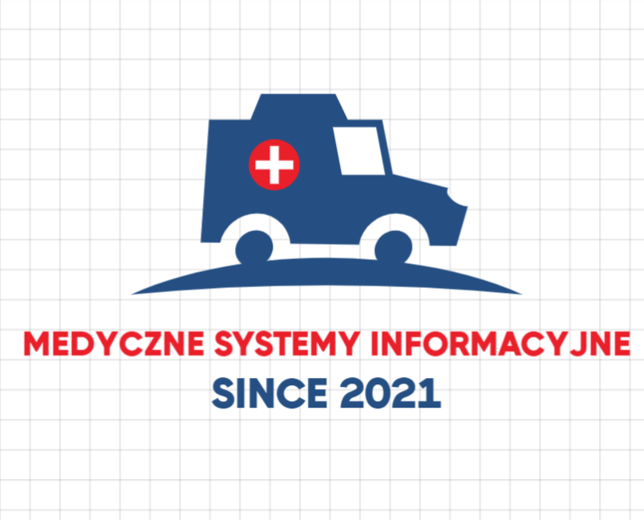

  

## Team
Our team consists of the following members:

* [Grzegorz Wrona](https://github.com/vroniu)
* [Marcin Borkowski](https://github.com/MarBor2000)
* [Igor Mazur](https://github.com/ijmazur)

## Project Description [still need to be updated]
Our project is to develop
an ambulance service system.
It mainly consists of
an extended communication
between the 
and the dispatcher.

## Build with
Project is created with:

<h1 align='center'>⚡️<i>Stay awesome!</i>⚡️</h1>

        

